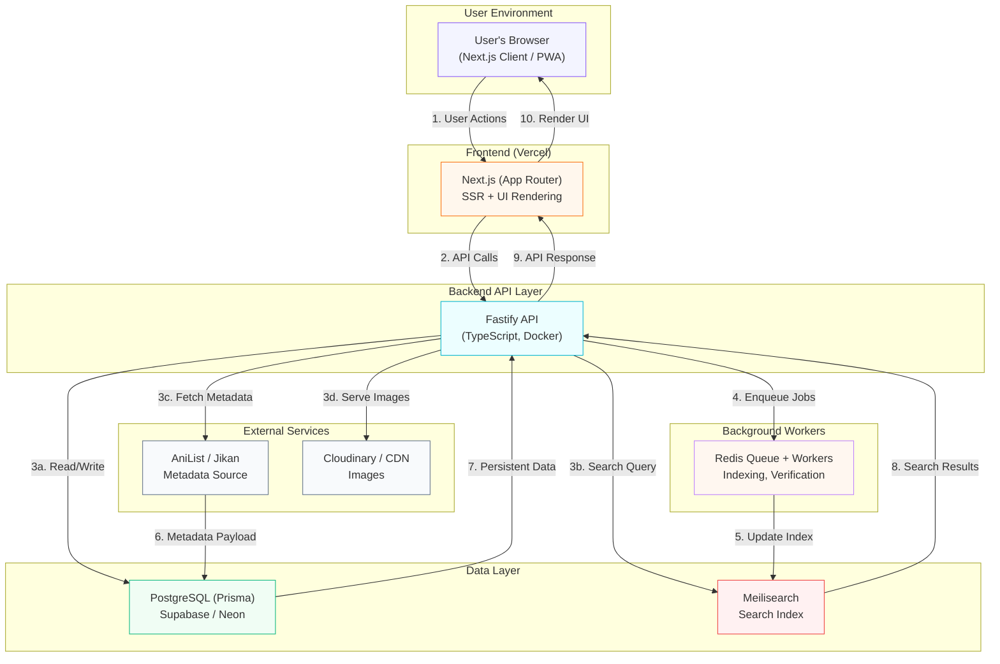
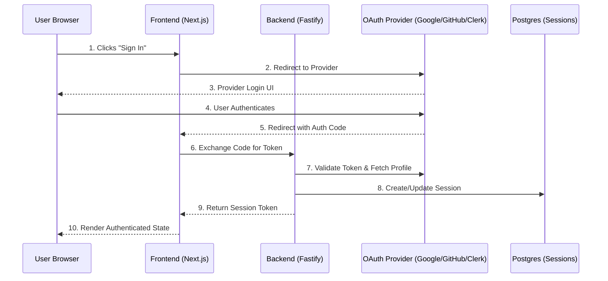

# Shuroku — Your Personal Anime Library & Watch Progress Tracker

*Shuroku* (収録) — “to record, compile, collect.”
Inspired by this Japanese concept, Shuroku is a clean, modern space to **search**, **save**, **track**, and **watch** your favourite anime from one unified dashboard.

Search any anime. Add it with one click. Track your episodes. Organize collections. Discover free/paid sources.
Users can also add their own free sources, helping the community discover legal places to watch.

---

## 🚀 Key Features

### 🔍 Powerful, Fast Search

* Lightning-fast fuzzy search (Meilisearch + AniList API)
* Real-time suggestions with posters & titles
* Clean results grid with a one-tap **Add to Library** button

### 📚 Personal Anime Library

* Add anime instantly with a single click
* Track statuses: **Watching · Completed · Plan to Watch · Paused**
* Create custom collections (*Weekend Binge*, *2025 Marathon*, etc.)
* Reorder, rename, and personalise lists

### 🎯 Watch Progress Tracking

* Track progress per season/episode
* Quick update from tiles or the details page
* Auto-sync progress across devices
* Optional notes & ratings

### 🎥 Free & Paid Watch Sources (User-Addable)

* View verified free & paid sources for each anime
* Redirect to official paid platforms (Crunchyroll, Netflix, Prime Video, etc.)
* Open embeddable free sources inside the app (when supported)
* Users can add new free sources (flagged as **Unverified User Sources**)

### ✨ Clean, Modern UI

* Minimal, fast, mobile-first experience
* Smooth interactions with thoughtful UX details
* Built for performance and simplicity

### 📦 Export / Backup

* Export your entire library as JSON
* Import anytime to restore lists and progress

---

## 🧩 Tech Stack (Modern & Opinionated)

### **Frontend**

* **Next.js 15** (App Router)
* **React + TypeScript**
* **Tailwind CSS**
* **React Query** (server state management)
* **Zustand** (UI state)

### **Backend**

* **Fastify (TypeScript)**
* **Prisma ORM**
* **PostgreSQL** (Supabase / Neon)

### **Search**

* **Meilisearch** for fast fuzzy search

### **Auth**

* Email/Password + OAuth (Google/GitHub) via **NextAuth** or **Clerk**

### **External Services**

* **AniList GraphQL API** / **Jikan API** for metadata
* **Upstash Redis** for background jobs
* **Cloudinary** for image optimization

---

## 📐 System Architecture — Visual Overview



---

## 🔐 Auth Flow (Detailed)



---

## 🗂 Proposed Folder Structure

```
/shuroku
│
├── app/                 # Next.js frontend
├── src/                 # Fastify backend
├── prisma/              # Schema + migrations
├── public/              # Static assets
├── docs/                # PRD, system design, API specs
├── design/              # Wireframes / figma
└── README.md
```

---

## 🧭 Core User Flows

* Search any anime
* Add to your library with one click
* Open detailed page → synopsis, metadata, sources
* Track episodes with season/episode picker
* Create & manage collections
* Add free streaming sources
* Redirect to official paid platforms
* Export your entire library

---

## 📊 Roadmap

### **MVP**

* Search (typeahead + grid)
* Library management
* Watch progress tracking
* Collections (CRUD)
* Anime detail pages
* Free/Paid source viewer
* User-added sources
* OAuth + Email/Password login
* Export/Import

### **v1.1**

* Recommendations (tag-based)
* Recently Watched
* Episode reminders

### **v1.2**

* Public collections (shareable)
* Offline mode (PWA)

---

## ⚙️ Local Development

```bash
git clone https://github.com/your-username/shuroku
cd shuroku
npm install

# Frontend
npm run dev

# Backend (separate terminal)
npm run api
```

**Setup:**

* Create `.env` with DB, Meilisearch, and OAuth keys
* Run `npx prisma migrate dev` to initialize the database

---

## 📜 License

All rights reserved. See `LICENSE.txt` for full terms.

---

## 🛡 Legal Notice

Shuroku **does not host copyrighted content**.
User-submitted URLs are marked as **Unverified User Sources**.
Paid services use official redirect / deep-link flows.

---

## 🤝 Contributing

PRs and suggestions are welcome!
See `/docs/contributing.md` (coming soon).

---

## ✨ Author

Built by **Aditya Sinha** — exploring PM + engineering through real-world product builds.
