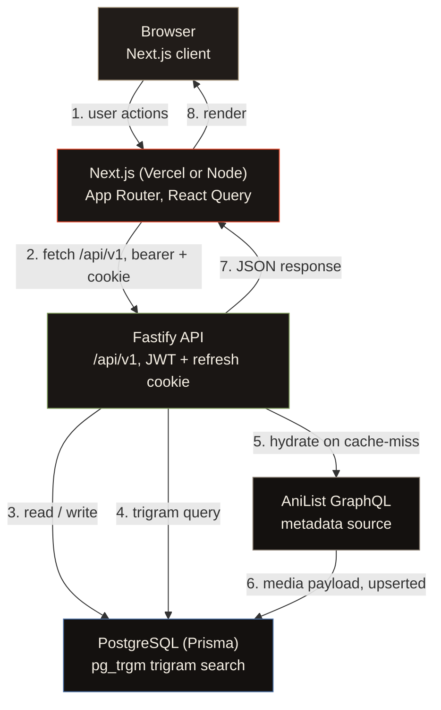
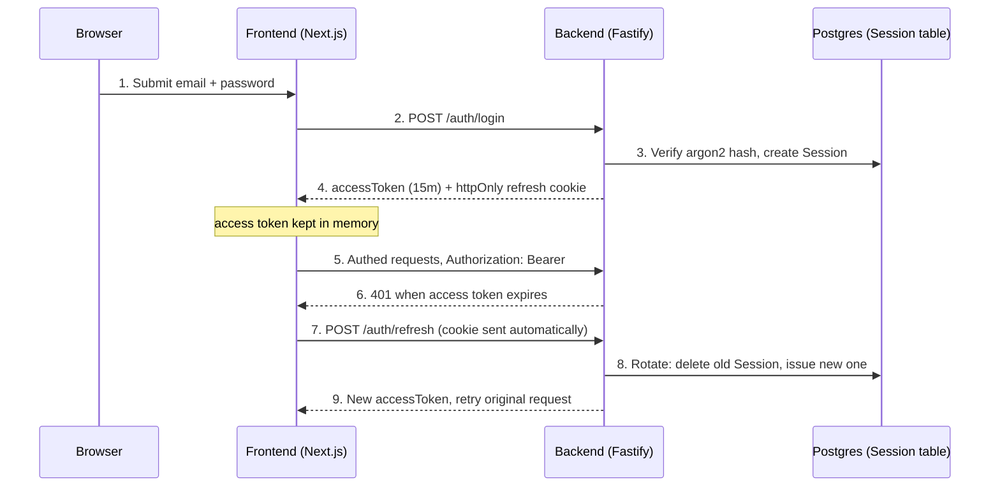

# Shuroku — 収録

*Shuroku* (収録, "to record, compile, collect") is a personal anime library and watch-progress tracker. Search any anime, add it to your library, track episodes, organize collections, and keep a list of where to watch it, all from one calm dashboard.

Multi-user with accounts, no payments, no paywall. Built to be run by you and shared with a few people for feedback.

This repo is a two-package monorepo:

- `backend/` — Fastify + TypeScript + Prisma + PostgreSQL API
- `frontend/` — Next.js 15 (App Router) + Tailwind, the "Ink & Vermillion Archive" design

---

## Stack

**Frontend**
- Next.js 15 (App Router) + React + TypeScript
- Tailwind CSS
- TanStack React Query for server state (no Zustand; UI state is React context)

**Backend**
- Fastify (TypeScript, ESM) with Zod-validated routes
- Prisma ORM + PostgreSQL (local Docker, or Neon / Supabase free tier)

**Search**
- PostgreSQL `pg_trgm` trigram match over cached titles (no external search service)

**Auth**
- Email and password with argon2 hashing
- Short-lived JWT access token + rotating refresh token in an httpOnly cookie
- No OAuth provider; no NextAuth or Clerk

**Metadata and images**
- AniList GraphQL API (free, no key) for metadata
- Cover and banner images hotlinked from the AniList CDN (no Cloudinary)

---

## Architecture


```mermaid
flowchart TD
  classDef client fill:#211C19,stroke:#A8987F,color:#F5EFE4
  classDef fe fill:#1A1614,stroke:#E8482B,color:#F5EFE4
  classDef be fill:#1A1614,stroke:#7E9B5A,color:#F5EFE4
  classDef data fill:#14110F,stroke:#4A6FA5,color:#F5EFE4
  classDef ext fill:#14110F,stroke:#8A7F73,color:#F5EFE4

  A["Browser<br/>Next.js client"]:::client
  F["Next.js (Vercel or Node)<br/>App Router, React Query"]:::fe
  S["Fastify API<br/>/api/v1, JWT + refresh cookie"]:::be
  P["PostgreSQL (Prisma)<br/>pg_trgm trigram search"]:::data
  AN["AniList GraphQL<br/>metadata source"]:::ext

  A -->|1. user actions| F
  F -->|2. fetch /api/v1, bearer + cookie| S
  S -->|3. read / write| P
  S -->|4. trigram query| P
  S -->|5. hydrate on cache-miss| AN
  AN -->|6. media payload, upserted| P
  S -->|7. JSON response| F
  F -->|8. render| A
```

AniList hydration on a search cache-miss is synchronous today. If AniList latency shows up under real use, move it to a job queue (see Possible future direction).

---

## Auth flow


```mermaid
sequenceDiagram
  participant U as Browser
  participant FE as Frontend (Next.js)
  participant BE as Backend (Fastify)
  participant DB as Postgres (Session table)

  U->>FE: 1. Submit email + password
  FE->>BE: 2. POST /auth/login
  BE->>DB: 3. Verify argon2 hash, create Session
  BE-->>FE: 4. accessToken (15m) + httpOnly refresh cookie
  Note over FE: access token kept in memory
  FE->>BE: 5. Authed requests, Authorization: Bearer
  BE-->>FE: 6. 401 when access token expires
  FE->>BE: 7. POST /auth/refresh (cookie sent automatically)
  BE->>DB: 8. Rotate: delete old Session, issue new one
  BE-->>FE: 9. New accessToken, retry original request
```

---

## Folder structure

```
shuroku/
├── backend/                 # Fastify API
│   ├── prisma/              # schema, seed, trigram SQL
│   │   ├── schema.prisma
│   │   ├── seed.ts
│   │   └── sql/add_trgm_search.sql
│   ├── src/
│   │   ├── app.ts           # plugins, error envelope, route registration
│   │   ├── server.ts
│   │   ├── env.ts
│   │   ├── lib/             # prisma client, AniList client
│   │   ├── plugins/auth.ts  # JWT verify + requireAuth
│   │   └── routes/          # auth, search, anime, library, collections, sources, export
│   ├── docker-compose.yml   # local Postgres
│   └── README.md
├── frontend/                # Next.js app
│   ├── src/
│   │   ├── app/             # routes: /, /anime/[id], /collections, /search, /settings, /login, /register
│   │   ├── components/      # shell, ui, palette, collection picker
│   │   ├── lib/             # api client, hooks, auth, theme, toast
│   │   └── types/api.ts
│   └── README.md
└── README.md                # this file
```

---

## Run order

Backend first, frontend second.

```bash
# 1. Backend (http://localhost:4000)
cd backend
docker compose up -d                      # local Postgres
npm install
cp .env.example .env                      # set JWT_SECRET to 32+ chars
npx prisma migrate dev --name init
npx prisma migrate dev --create-only --name add_trgm_search
#   paste backend/prisma/sql/add_trgm_search.sql into the generated migration.sql
npx prisma migrate dev
npm run seed                              # me@shuroku.local / changeme123
npm run dev

# 2. Frontend (http://localhost:3000), separate terminal
cd frontend
npm install
cp .env.local.example .env.local          # NEXT_PUBLIC_API_URL defaults to the backend
npm run dev
```

Full per-package detail lives in `backend/README.md` and `frontend/README.md`.

### Environment

Backend `.env`: `DATABASE_URL`, `JWT_SECRET`, `CORS_ORIGIN`, `PORT`, `NODE_ENV`, `ACCESS_TOKEN_TTL`, `REFRESH_TOKEN_TTL_DAYS`, `COOKIE_SAMESITE`. No Meilisearch or OAuth keys are needed.

Frontend `.env.local`: `NEXT_PUBLIC_API_URL` (defaults to `http://localhost:4000/api/v1`).

Local dev is same-site, so the default `lax` cookie works. For a cross-domain production deploy, set `COOKIE_SAMESITE=none` (which forces Secure, so both sides must be HTTPS) and add the frontend origin to `CORS_ORIGIN`.

---

## Features

- Account sign-up and login, with sessions that persist across devices
- Search via cached trigram match, falling back to AniList and caching the result
- Library with status (Watching, Completed, Plan to Watch, Paused), per-episode progress, rating, and notes
- One-tap "+1 episode" with optimistic update, on cards and the detail page
- Collections: create, delete, and add or remove titles from the detail page
- Sources per anime: official and free, with user-added entries flagged by submitter
- Continue Watching rail, grid and list views, light and dark themes
- Command palette (⌘K) for fast search and quick-add
- JSON export and import of your library from Settings

Sources currently open in a new tab. The schema carries an `embeddable` flag, but in-app embedded playback is not implemented yet.

---

## API

All routes are under `/api/v1`. The full table, including auth requirements, is in `backend/README.md`. Summary: auth (`register`, `login`, `refresh`, `logout`, `me`), `search`, `anime/:id`, `library` CRUD plus `increment`, `collections` CRUD plus item add/remove, `anime/:id/sources` and `sources/:id`, and `export` / `import`.

---

## Possible future direction

Not built yet. Listed so the intent is on record, not as current behavior.

- Tag-based recommendations (genres are already stored per title)
- Stats and insights view (episodes watched, completion rate, watch heatmap)
- AniList list import keyed by `anilistId` to remove cold-start friction
- Episode reminders for airing shows (needs a background job layer such as Upstash QStash)
- Public, shareable collections
- PWA / offline mode, and eventually a mobile app reusing the same API
- Move synchronous AniList hydration to a job queue; add a cron to purge expired sessions
- Introduce Meilisearch only if trigram search quality draws complaints

---

## Legal

Shuroku does not host copyrighted content. User-submitted sources are stored as unverified entries identified by their submitter. Official platforms are reached by ordinary links.

## License

All rights reserved. See `LICENSE.txt` for full terms.

## Author

Built by Aditya Sinha.
